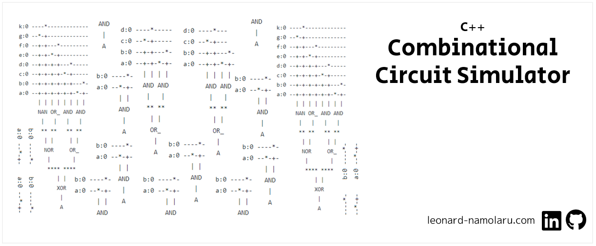

### [Français] Simulateur de circuit combinatoire en C++
> :school: **Lieu de formation :** Université Paris Cité, Campus Grands Moulins (ex-Paris Diderot)
> 
> :books: **UE :** Langages à objets avancés 
> 
> :pushpin: **Année scolaire :** M1
> 
> :calendar: **Dates :** nov. 2021 - janv. 2022 
> 
> :chart_with_upwards_trend: **Note :** 14/20

Un ensemble de types/fonctions permettant de créer un circuit combinatoire, c’est-à-dire un circuit sans boucle comprenant des portes logiques (AND, OR, NOR, etc) reliées ensembles par des « fils ». L’entrée du circuit est représentée par un ensemble de portes chacune représentant une variable booléenne nommée.

#### Principales fonctionnalités
- Affichage du circuit sous une une forme agréable en mode texte (pas d’interface graphique).
- La simulation s’effectue en mode pas à pas, c’est-à-dire qu’à chaque pas l’information franchit au plus une porte, et il est possible de voir dans l’affichage la progression de l’information.
- Affichage sous forme textuelle de la sortie à l’aide des variables d’entrée : Par exemple : `A = xor(or(a, b), and(a, b)`
- Autres fonctionnalités : sauvegarder un circuit dans un fichier et le relire.

#### Compilation
```
lenny@DESKTOP-DMJ749K:/mnt/c/Users/lenny/git/projet-cpp$ ls
Debug  Diagramme_de_classes.png  README.md  Raport_Projet.pdf  src

lenny@DESKTOP-DMJ749K:/mnt/c/Users/lenny/git/projet-cpp$ cd src
lenny@DESKTOP-DMJ749K:/mnt/c/Users/lenny/git/projet-cpp/src$ make all
```

#### Exécution 
````
lenny@DESKTOP-DMJ749K:/mnt/c/Users/lenny/git/projet-cpp/src$ make test
````

Résultat attendu :
```
**** MENU : SIMULATEUR DE CIRCUIT COMBINATOIRE ***
1- Afficher le circuit
2- Simulation en mode pas a pas
3- Changer les valeurs des portes d'entree
4- Afficher sous forme textuelle
5- Synthetiser un circuit a partir d'une expression textuelle
6- Sauvegarder un circuit dans un fichier
7- Relire un circuit qui est dans un fichier
8- Quitter
Votre choix :
```

- Si vous tapez 1 directement après la première exécution du programme, cela affichera le circuit correspondant au code existant dans le `main.ccp` servant juste d'affichage standard à l'utilisateur au démarrage de l'application. L'utilisateur pourra ainsi voir les fonctionnalités du programme même sans création de circuit au préalable.

- Pour démarrer la simulation en mode pas à pas, tapez 2. Cela affichera l'évolution de l'information au fur et à mesure de son passage par les portes logiques. En tapant 2 directement après l'exécution du programme , le logiciel lance la simulation du circuit existant. 

- Pour changer les valeurs des portes d'entrée tapez 3. Ensuite, pour chaque entrée , le programme affiche l'ancienne valeur sous la forme suivante : `Nom de l'entrée : " NOM D'ENTRÉE"  ; Valeur : "VALEUR DE L'ENTRÉE" `. Le programme demande ensuite à l'utilisateur de rentrer une nouvelle valeur (soit 0, soit 1 ).

- Pour afficher le circuit sous forme textuelle tapez 4. En tapant 4 directement après l'exécution du programme cette option renvoie le chaine suivante, qui correspond au circuit existant:
```
A=AND(OR_(XOR(OR_(a,b),AND(a,b)),AND(OR_(c,d),AND(c,d))),XOR(OR_(AND(e,f),AND(a,b)),XOR(OR_(a,f),OR_(d,f))))  
```

- Pour synthétiser un circuit à partir d'une expression textuelle, tapez 5. On aura alors à donner l'expression textuelle du circuit qu'on voudrait créer (cf. Exemples)

- Pour sauvegarder un circuit dans un fichier, tapez 6. La chaîne sera enregistrée dans un fichier nommé `circuit.txt` dans le meme dossier. Si le fichier n'existe pas, le système le créera. S'il existe, le contenu précédent sera écrasé.

- Pour relire un circuit qui est dans un fichier tapez 7 

#### Exemples : synthetiser un circuit a partir d'une expression textuelle 
Option 5 du menu -> ENSUITE, Affichage : option 1 du menu

**Expression textuelle:** `A=and(a,b)`
```
b:0 ----*-
a:0 --*-+-
      | |
      AND
       |
       A
```

**Expression textuelle:** `A=or(and(a,b),and(c,d))`
```
d:0 ----*-----
c:0 --*-+-----
b:0 --+-+---*-
a:0 --+-+-*-+-
      | | | |
      AND AND
       |   |
       ** **
        | |
        OR_
         |
         A
```         
         
**Expression textuelle:** `A=xor(or(and(a,b),and(c,d)),nor(or(e,f),nand(g,k)))`
```
k:0 ----*-------------
g:0 --*-+-------------
f:0 --+-+---*---------
e:0 --+-+-*-+---------
d:0 --+-+-+-+---*-----
c:0 --+-+-+-+-*-+-----
b:0 --+-+-+-+-+-+---*-
a:0 --+-+-+-+-+-+-*-+-
      | | | | | | | |
      NAN OR_ AND AND
       |   |   |   |
       ** **   ** **
        | |     | |
        NOR     OR_
         |       |
         **** ****
            | |
            XOR
             |
             A
```
                   
**Expression textuelle:** `A=and(xor(or(and(a,b),and(c,d)),nor(or(e,f),nand(g,k))),xor(or(and(z,y),and(x,w)),nor(or(u,v),nand(p,q))))` 
```
q:0 ----*-----------------------------
p:0 --*-+-----------------------------
v:0 --+-+---*-------------------------
u:0 --+-+-*-+-------------------------
w:0 --+-+-+-+---*---------------------
x:0 --+-+-+-+-*-+---------------------
y:0 --+-+-+-+-+-+---*-----------------
z:0 --+-+-+-+-+-+-*-+-----------------
k:0 --+-+-+-+-+-+-+-+---*-------------
g:0 --+-+-+-+-+-+-+-+-*-+-------------
f:0 --+-+-+-+-+-+-+-+-+-+---*---------
e:0 --+-+-+-+-+-+-+-+-+-+-*-+---------
d:0 --+-+-+-+-+-+-+-+-+-+-+-+---*-----
c:0 --+-+-+-+-+-+-+-+-+-+-+-+-*-+-----
b:0 --+-+-+-+-+-+-+-+-+-+-+-+-+-+---*-
a:0 --+-+-+-+-+-+-+-+-+-+-+-+-+-+-*-+-
      | | | | | | | | | | | | | | | |
      NAN OR_ AND AND NAN OR_ AND AND
       |   |   |   |   |   |   |   |
       ** **   ** **   ** **   ** **
        | |     | |     | |     | |
        NOR     OR_     NOR     OR_
         |       |       |       |
         **** ****       **** ****
            | |             | |
            XOR             XOR
             |               |
             ******** ********
                    | |
                    AND
                     |
                     A
``
